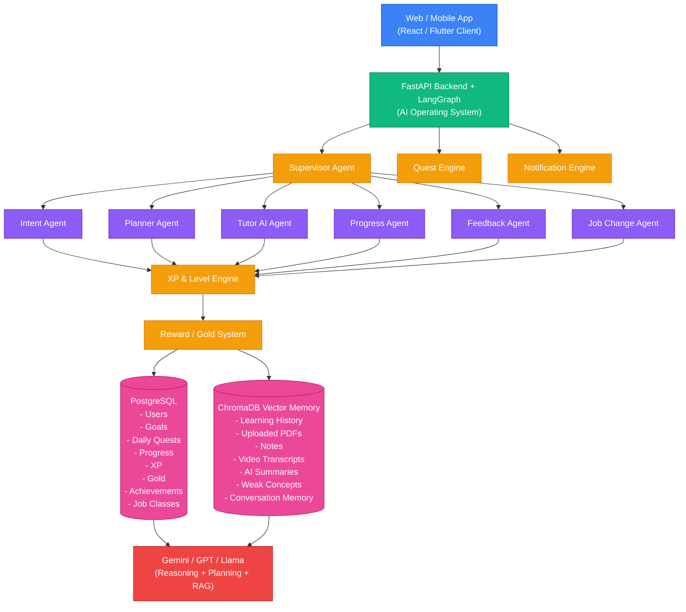

# QuestDemics: AI Operating System for Skill Mastery
# MVP: https://questdemics.netlify.app/
( Fill the dummy Login Details to access it )
> *"This isn't a learning platform with AI. It's an AI operating system that orchestrates the learning platform."*

QuestDemics is an intelligent, autonomous learning agent and RPG progression system modeled like "Solo Leveling." The learner acts as a **Hunter** progressing toward mastery, and the AI serves as **The System**—continuously observing, reasoning, adapting, and intervening to guide the Hunter from novice to master.

---

## 🏗️ System Architecture



QuestDemics is structured to ensure maintainability, testing, and scalability:

1. **Experience Layer (Frontend):** React + Vite, TypeScript, Tailwind CSS, Framer Motion, Zustand, React Router, and Lucide Icons.
2. **Application Layer (Backend):** FastAPI, SQLite/PostgreSQL (SQLModel/SQLAlchemy ORM), and JWT auth utilities.
3. **Intelligence Layer (AI Agents):** LangGraph with Gemini, GPT, or Llama models, featuring custom Vector Indexing (RAG).

---

## 🎮 Core System Mechanics

- **Observe & Learn:** The System records study durations, distraction counts, and quiz metrics to build active memory profiles.
- **Main Quests:** Your goals (e.g., "Become ML Engineer") are parsed into structured multi-week milestones.
- **Daily Quests:** Dynamic, randomized daily parameters (Read, Quiz, Practice) focused on strengthening weak topics.
- **Recovery Quests:** Missing a daily quest triggers a lock on normal progression, requiring a review of past mistakes to restore the streak.
- **Anti-Fatigue Gate:** If a Hunter trains for more than 6 hours in a single day, the System locks the workspace for 60 minutes for recovery.
- **Boss Battles:** Replaces exams with 90-minute practical coding tasks. Your submission is graded by the AI against relocation criteria to unlock S-Rank eligibility.
- **Gold & XP Shop:** Earn gold through quizzes and battles; spend it in the System Shop to unlock Mind Maps, AI Cheat Sheets, or interview preparation materials.

---

## 🚀 Quick Start Guide

### Prerequisite Environment
- **Node.js** v20+ & **npm**
- **Python** 3.12+ & **pip**

---

### 1. Backend API Server Setup

1. Navigate to the backend folder:
   ```bash
   cd webapp/backend
   ```

2. Supply your Gemini credentials in `.env` (Copy from `.env.example`):
   ```bash
   # Add your key to activate high-fidelity AI models
   GEMINI_API_KEY=your_gemini_api_key_here
   ```
   *Note: If no API key is provided, the backend automatically falls back to a realistic Simulation Mode so you can still test all UI flows, level ups, and evaluations without credentials!*

3. Install python packages:
   ```bash
   pip install -r requirements.txt
   ```

4. Awaken the System server:
   ```bash
   python run.py
   ```
   The API server will launch at: `http://localhost:8000`.

---

### 2. Frontend React Setup

1. Open a new terminal and navigate to the frontend folder:
   ```bash
   cd webapp/frontend
   ```

2. Install npm dependencies:
   ```bash
   npm install
   ```

3. Boot the development dev server:
   ```bash
   npm run dev
   ```
   Open your browser to the URL displayed (usually `http://localhost:5173`).

---

## 📁 Repository Structure

```text
QuestDemics/
│
├── webapp/
│   ├── backend/
│   │   ├── app/       # Intent Parsing, Quest Planning, and Tutor RAG agents
│   │   │   ├── agents/
│   │   │   ├── routes/
│   │   │   ├── auth_utils.py
│   │   │   ├── db.py
│   │   │   ├── models.py
│   │   │   └── main.py
│   │   ├── requirements.txt
│   │   └── run.py
│   │
│   └── frontend/
│       ├── src/
│       │   ├── pages/
│       │   ├── store.ts
│       │   ├── App.tsx
│       │   ├── index.css
│       │   └── main.tsx
│       ├── index.html
│       ├── tailwind.config.js
│       └── postcss.config.js
│
├── netlify.toml
└── README.md
```
